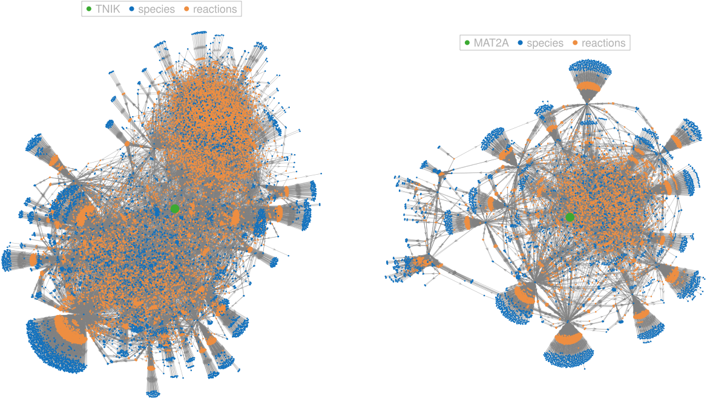

# Virtual cell model

This repository illustrates the core features of our latest (stable) fully mechanistic, genome-scale ODE-based model of human cell biology.

> Version: `ODEVC`-`23.65.4720`-`20260721T173726`

## Overview

We constructed a human biological network (directed hypergraph) through semi-automated extraction and manual curation from public and proprietary data sources. The network currently contains 19M edges and 4.8M nodes (species + reaction nodes; see table below). Due to its size, full visualization is impractical; instead, we show representative nearest-neighbor subnetworks centered on selected target genes (up to distance $d=2$ species nodes; edges partially shown).

The network is used to build a mechanistic, compartmentalized model of cell biology formulated as a system of ordinary differential equations (ODEs). This generic model is deployed within our AI-driven biosimulation platform (https://netabolics.ai/) for time-resolved simulation (see the [`demo`](https://github.com/Netabolics/demo) repository). 

## Features

Overall, the ODE system integrates **gene regulatory network** (GRN) to model upregulation or downregulation of gene products expression, **signal transduction network** (STN) to model activation/inhibition reactions among gene-encoded products, **metabolic reactions network** (MRN) to model biochemical processing of metabolites by enzyme-catalyzed reactions and carrier-mediated transport processes, and **protein-interaction network** (PIN) to model formation of protein (super)complexes. 

Specifically, the model incorporates the components listed in the following table.

| Component | Number | Class | Type/Example |
| --------- | ------ | ----- | ---- |
| Compartments | **9**+1 (\*)
| | | extracellular | reservoir (e.g., blood) (\*) extracellular space |
|              |  | intracellular | cytosol mitochondrion (intermembrane space) mitochondrion (matrix) nucleus (sarco)endoplasmic reticulum Golgi apparatus peroxisome lysosome |
| Genes | **22,900** | | complete list in [`genes.csv`](genes.csv) |
| Molecular Species | **64,556** (\*\*)
| | | gene products | proteins (via mRNA) &nbsp;&nbsp;*signaling proteins* &nbsp;&nbsp;*transcription factors* &nbsp;&nbsp;*enzymes* &nbsp;&nbsp;*channels/transporters* long non-coding RNAs (lncRNA) micro RNAs (miRNA) |
| | | complexes | enzymatic, regulatory |
| | | small molecules | metabolites ions cofactors second messengers |
| Gene-associated Reactions | **4,719,956**
| | | signal transduction | activation/inactivation (kinases, phosphatases, receptors, G-proteins) |
| | | gene regulation | upregulation/downregulation of gene expression |
| | | complex formation | binding, physical interactions |
| | | enzymatic catalysis | biosynthesis, energy metabolism |
| | | intercompartmental transport | transmembrane, carrier/channel-mediated |

(\*) Reservoir compartment as source/sink, i.e., supplying/accepting substances to/from the environment.

(\*\*) As total molecular species (corresponding to the number of ODEs). This exceeds the number of unique molecular species because many of them exist in different states (e.g., phosphorylated vs dephosphorylated proteins) and/or in different compartments.

The model has a total of approx. **24M parameters**, including state-independent (stoichiometric, kinetic, catalytic, and thermodynamic) and state-dependent (initial conditions and activation/conformation) quantities.

## Current Status and Planned Updates

The system of ODEs can be parametrized either without or with experimental OMICs data to generate cell type- or tissue-specific instances. 
- Knowledge-driven parametrization: self-consistent estimation based on known or derived kinetic and thermodynamic constraints. 
- Data-driven parametrization: gradient-based optimization (e.g., Adam) and either Continuous Adjoint (CA) or Automatic Differentiation (AD) for the backward-pass.

For forward-pass, we use either a parallel ensemble ODE solver (ensemble simulation) or a GPU-accelerated ODE solver (single simulation). GPU-accelerated ensemble solving is feasible depending on the available VRAM. Our theoretical non-equilibrium thermodynamics framework (an ODE-based instantiation of [GENERIC](https://en.wikipedia.org/wiki/GENERIC_formalism)-like reversible-irreversible dynamics) allows very efficient solver scalability. As an illustration, 1 hour of simulation time can be integrated in seconds on a consumer GPU using fixed time-step methods (e.g., RK4).

The model has been trained and benchmarked on multiple public datasets, showing improving out of distribution (OOD) generalization. The work is in progress and results are not yet published.

We are constantly working to extend model's gene coverage. Currently, we are curating further gene-associated reactions to reach a complete coverage of the protein-coding genes and near-complete coverage of the known non-coding RNA genes. Our major planned update is to scale the model to multi-cellular systems.

## Further Reading

DiNuzzo M. How artificial intelligence enables modeling and simulation of biological networks to accelerate drug discovery. *Frontiers in Drug Discovery*, 2:2022. [10.3389/fddsv.2022.1019706](https://doi.org/10.3389/fddsv.2022.1019706)

## Copyright Notice

The biological network, the model, and the biosimulation software are proprietary assets of Netabolics.

For any inquiries, please [contact us](https://netabolics.ai/#contacts).

&nbsp;

Copyright &copy; 2020-2026 by Netabolics SRL. All rights reserved.

